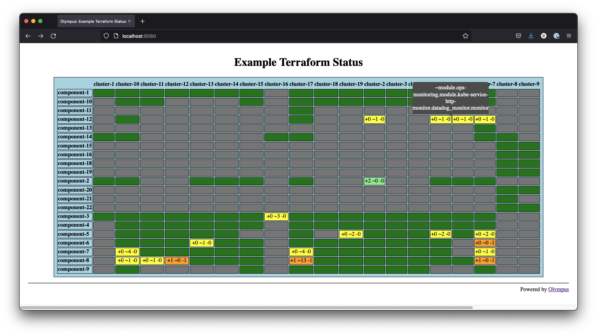

# olympus

See the status of terraform plan across many components in many environments.

## Project Status

Development.

A proof-of-concept that has demonstrated utility but is not yet operationalized.

## Overview

This is currently an experimental project in Terraform and GitOps to support visualization of status
across many environments and components. Agents can run terraform plans for components in
environments and report that plan information to a server, which then displays status and
aggregates.

The specific use case if having many environments based off of the same terraform code and "
promoting" changes from one to another (e.g. dev to staging to prod). Existing CI/CD systems, while
they could generally do the work, do not present good visualizations. Existing terraform gitops
solutions are either commercial or have a single-cluster assumption and a weaker security model.

I have seen a number of other systems and they all fall short of meeting my needs in some way. Some
of them are heavily committed to their paths.

This is an experimental project to find out how to address those shortcoming and explore needs. It
may eventually be a open source project intended as an complement to more narrowly focused systems.

## Existing Features

* An agent which can be run singly to produce and send plans from multiple components to the storage
  server.
* A UI server (which currently communicates with storage via the file system) which provides a
  matrix with status and change information.

### Why is this useful?

Because it produces a useful visualization of status that is hard to otherwise create.

### Can I install it and use it now?

Not hardly. Right now it requires a lot of manual running of commands. Dockerfile are untested and
no installation documentation exists. Caveat Emptor barely begins to cover it.

## Compared to...

### Terraform Enterprise

* This is open source
* This is self hosted

### Atlantis

* Olympus focuses on presenting a view of status across many environments.

## Design Considerations

First class considerations:

* There are many clusters. We want views across clusters
* Security -- specificly the ownership and control of secret information
* Flexibility -- we are not going to assume how to run the various tools. Tools should be extensible
  and replaceable.

## Security Design

This approach to security describes the current code base and anticipated future extensions.
Security is a first class goal of the design.

The basis for security is:

* Keep all secrets in the secure environments
* The secure environments initiate all communication

Specifically:

* The server SHALL NOT have access to source code or any secret information
* The server CANNOT change agent configuration. The server MAY only publish a desire for updates to
  certain information.
* The server MAY, in the future, indicate a desire to the agents to apply a specific plan.
* The storage/logic server and the UI MAY be separate components
* The agents WILL have access to secrets and WILL push sanitized results information to the server.
* The agent WILL ONLY have local configuration, including which source to pull and which commands to
  run. It SHALL NOT receive this information from the server
* `terraform apply` (if/when implemented) SHALL run *ONLY* on branches pre-configured
* At some point, the server MAY have access to certain SCM branch information (so that it can
  indicate a need for plan information from PR branches). This MAY involve an additional component
  with access to source or source meta-information. It will *NOT* require the server to have this
  access, and the component will not need the same level of access as the agents performing plan or
  apply.
* SSO/Login protection SHALL be done with an external service in front of the UI

## Design

This consists of a microservice architecture comprised of:

* storage server -- a server that receives `terraform plan` data from agents and provides it to the
  UI and other data consumption components.
* agent -- runs in a highly secure context, can pull terraform source code and run plans. After
  redacting secrets from plans (actually all variables right now), sends plans to the storage
  server. Eventually may be able to run terraform apply. Agent/server protocol will facilitate
  independent agents which auto-scale to meet server desires in a timely manner.
* ui server -- UI/display logic which requests data from the storage server and renders it in
  interesting ways.
* notification server -- This will eventually provide webhook or other notification support to
  external systems. It will also produce statistics and logs about the state of the entire system.
* and SCM watcher system will observe the SCM system and notify the server of desire to produce
  plans for various branches.

## Thoughts about future implementation

### Agent

The agent should be pre-configured with a list of repos. It should run in a mode where it plans and
pushed plan information to the server, or a mode in which it retrieves server needs and creates
plans on that basis (to allow cooperation with other agents).

It should be possible for the server to request plans on specific branches, so the server can
present "what if" information for PRs.

When the agent is capable of applying, the branch(es?) on which it can apply should be specified in
configuration. The server should be able to indicate a desire to apply (driven by user input or
automation rules).

### Storage Server

The storage server should keep historical runs, and provide some interesting information to the UI
based on history. Examples could include drift tracking as well as "point in time snapshot" of state
of the system.

### Server/Agent interaction

The server should support and endpoint which returns a *single* component plan request when provided
a list of repos for which an agent can plan. When that is retrieved, the server should not provide
it to another agent until a suitable timeout period has elapsed.

Agents should retrieve multiple plan requests until they have reasonably saturated their resources,
but NOT queue requests. This will allow standard auto-scaling algorithms to scale up agents to meet
server needs.

### UI

* more than just 2 levels
* drill down
* implement storage server interaction as an "fs" object, so that we can easily develop UI against
  static data on the file system.

## TODO:

* create storage protocol between server and UI component
* track failed run information from agents
* change server to [GIN framework](https://gin-gonic.com/)
* create server data needs publishing mechanism
* secure communication between agent and server with hashed, pre-shared secrets
* use https://github.com/shirou/gopsutil or https://github.com/mackerelio/go-osstat have the
  agent hit a target CPU instead of a fixed number of parallel processes

## Milestones

### Next

At the end of this milestone it will be possible to install and run the server and UI server for
shared use.

Agents will still run manually.

UI should show failed runs as failed and not just no data.  (We should tolerate a certain number of
runs that fail due to a terraform lock before getting upset, though calling out long term stuck
locks will also be useful.)

### Next + 1

The agent can run in an automated fashion, albeit very naively. Plan information on a single branch
will be updated periodically.

UI should show components for which the plans are excessively old.

At least sketchy installation documents provided so that a savvy engineer has a chance of deploying
this thing.

### Next + 2

Agent auto-scaling facilitated. This should substantially reduce how out of date plans are.

### Next ++

Distinguish changes from drift

### Next ++

Multiple branches supported, so that we can get an idea of the consequences of a specific PR before
it's merged. This should be in a RESTful *and* predictable URL so that it can be put on e.g. a PR
comment.

UI will suppport indicating branches of interest. These will be limited in number to avoid spending
all of agents time calculating dead branches.  (Hmmm -- we don't care much about drift for PRs -- so
maybe don't re-run a plan unless the commit has changed? That implies that the agent should have a "
no changes, just update timestamp" message.)

It would be really nice if we could gate a PR on a plan being available for all impacted components.

### Next ++

Can "diff" changes between multiple branches -- i.e. show a branch and show only the changes it
would make less the changes the main trunk would also make.

### Far Future

A user can "approve" a plan in the UI and an agent will apply it.

## Author and Feedback

Created by Dewey Sasser <dewey@deweysasser.com

Please use GitHub issues and discussions. Note that this is very much "developing ideas" at this
point.

Also, note that I do *NOT* know everything and may be reinventing some wheels. Any information on
that is welcome, as are ideas, use cases, and needs.